# Hi 👋, I'm gift-li!

  

  
  
  

---

## 🛠️ Tech Stack

### 🚀 Programming Languages

  
  
  
  
  
  
  

### 🌐 Frontend & Backend Frameworks

  <!-- Frontend -->
  
  
  
  
  <!-- Backend -->
  
  
  
  

### ⚙️ DevOps & Cloud Tools

  
  
  
  
  
  
  

### 🗄️ Databases & Others

  
  
  
  

---

## 📊 GitHub Statistics

  <!-- Github stats & top-langs -->
  
  
   
  <!--GitHub 貢獻動態條（可自由選用，增添視覺豐富度） -->
  

